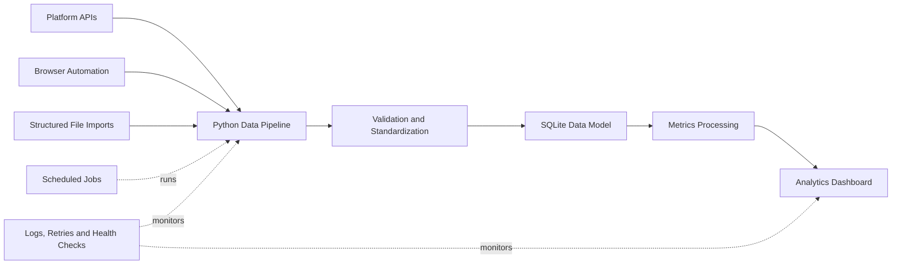

# Multi-Platform Content Analytics Automation System

## Project

Built a centralized analytics system that automates data collection, processing, storage, and reporting across multiple content platforms. It replaces fragmented manual reporting with one repeatable workflow.

## My Role

AI Automation & Python Developer

I designed the data model and implemented the collection, validation, normalization, storage, scheduling, monitoring, and dashboard layers.

## Tools

Python · REST APIs · Playwright · CSV/XLSX import pipelines · SQLite · HTML/CSS/JavaScript · scheduled jobs

## Workflow

The system supports account-level and content-level metrics while keeping platform-specific collection methods behind a consistent data model.

## Result

Created a single place to review account growth, publishing activity, content performance, cross-platform trends, and collection health. Repetitive report gathering became scheduled and auditable instead of manual.

## Public-Safe Note

The diagram is intentionally generalized. Real account identifiers, internal URLs, private metrics, databases, credentials, and operational logs are not included.

