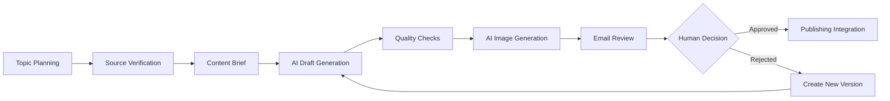

# AI-Powered Content Production & Approval Workflow

## Project

Designed and built an AI-assisted content production system that turns a manual editorial process into a structured, repeatable workflow while preserving human approval before publication.

## My Role

AI Automation & Python Developer

I connected planning, source verification, AI generation, quality checks, review states, version history, delivery, scheduling, and failure recovery.

## Tools

Python · AI APIs · image-generation APIs · publishing APIs · SQLite · SMTP email · scheduled tasks

## Workflow

Supporting controls include workflow states, version tracking, scheduled runs, structured logs, retries, and failure recovery.

## Result

Created a repeatable production pipeline that reduces repetitive editorial work without turning publishing into an uncontrolled fully autonomous process. Rejected drafts create new versions instead of overwriting earlier work.

## Public-Safe Note

This overview shows the reusable system design only. It excludes private articles, email addresses, account credentials, API tokens, internal paths, publishing identifiers, and company data.

