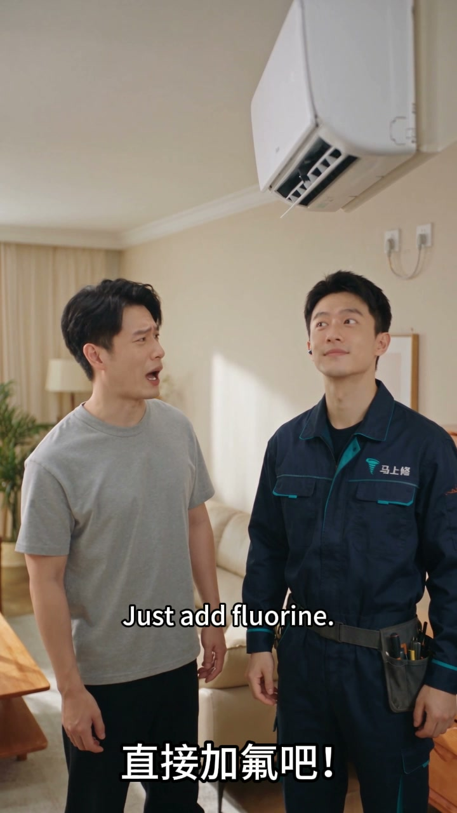
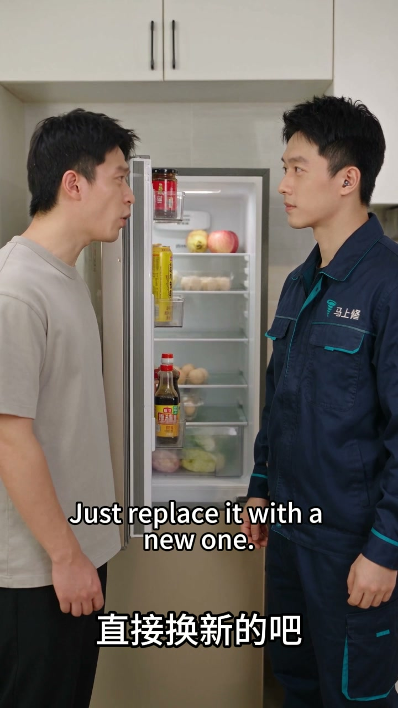
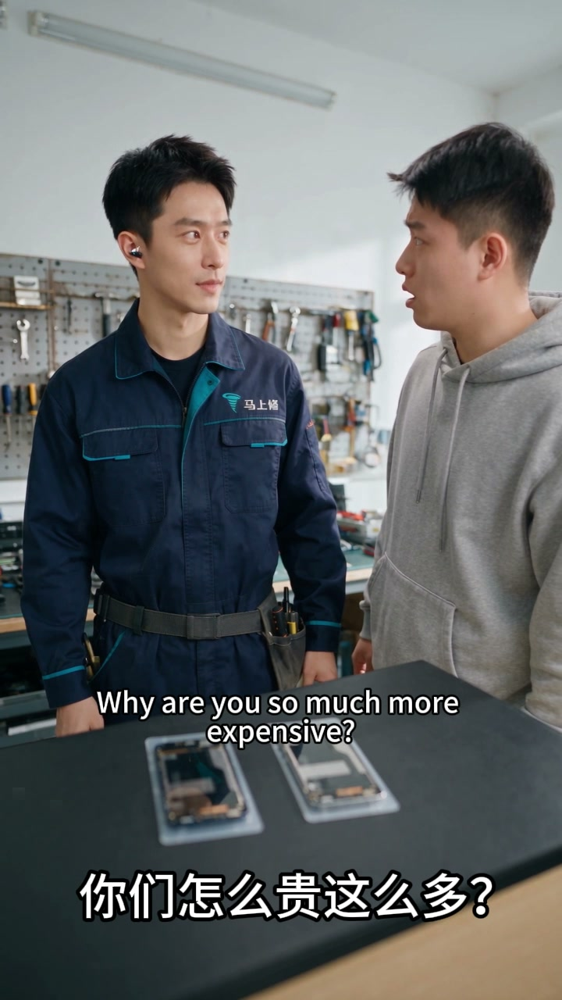

# AI Short-Video Production Workflow

## Project

Developed a repeatable AI-assisted workflow for producing short-form commercial videos for a repair-service brand. The work combines concept development, script structure, scene planning, generative video, consistency review, editing, captions, and sound.

## My Role

AI Video Creator & Editor

I handled concept and scripting, shot design, prompt iteration, generated-clip review, character and dialogue consistency, editing, pacing, bilingual subtitles, sound design, and final export.

## Tools

Generative AI video · AI image generation · prompt engineering · CapCut/video editing · script development · subtitle and audio editing

## Workflow

## Result

Built a reusable production method for 9:16 branded videos with concise narrative structure, consistent visual direction, controlled dialogue, bilingual captions, and publish-ready delivery.

## Selected Demos

Click a cover image to open the MP4.

### Air-Conditioner Repair Ad

### Refrigerator Repair Ad

### Phone Repair Ad

## Public-Safe Note

Only finished, public-facing creative samples are included. Source prompts, raw generations, internal campaign data, platform credentials, and unpublished business materials are excluded.

